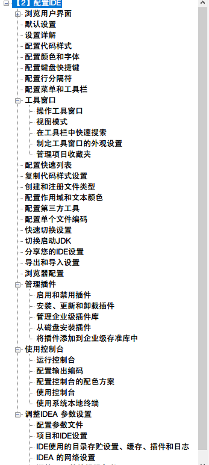
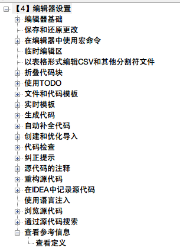
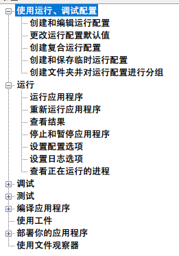
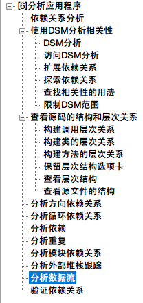

# IntelliJ IDEA 文档中文版
> **使用Google翻译对 [IntelliJ IDEA 的官方文档](https://www.jetbrains.com/help/idea/meet-intellij-idea.html)进行了大部分翻译，由于是机器翻译会出现大量的错误和不准确的地方，查阅时请对照英文版阅读。**

##  一些学习 IntelliJ IDEA 的资源

- 官方的教学视频：https://www.youtube.com/user/intellijideavideo/playlists
- 官方的插件库：https://plugins.jetbrains.com/idea
- 官方文档地址：https://www.jetbrains.com/help/idea/meet-intellij-idea.html
- 官方 Twitter：https://twitter.com/intellijidea
- 推荐一个比较好的中文文档教学：https://github.com/judasn/IntelliJ-IDEA-Tutorial
- Java IDE Idea 的中文汉化包：https://github.com/Yihy/resources_cn
- WebStorm 的中文汉化包：https://github.com/ewen0930/WebStorm-Chinese
- PhpStorm Chinese Language Pack（中文语言包）:https://github.com/ewen0930/PhpStorm-Chinese
- PyCharm Chinese Language Pack（中文语言包): https://github.com/ewen0930/PyCharm-Chinese
- IntelliJ IDEA 的编程等宽字体 Hack：https://github.com/source-foundry/Hack
- IntelliJ IDEA 的编程等宽字体 fantasque-sans： https://github.com/belluzj/fantasque-sans
- IntelliJ IDEA 的第三方主题 Material Theme UI ：https://github.com/ChrisRM/material-theme-jetbrains
- IntelliJ IDEA 的编程代码颜色设定：https://github.com/agileago/agileTheme

## 文档目录

1.  **第一章【初见 IntelliJ IDEA】**

2. **第二章【配置 IDEA】**

3. **第三章【配置项目】**

4. **第四章【编辑器设置】**

5. **第五章【构建、运行、测试和部署】**

6. **第六章【分析应用程序】**

   

