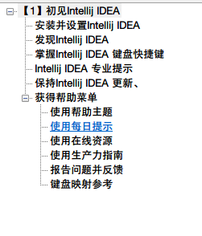
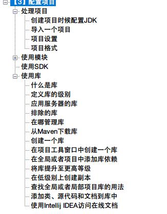

# IntelliJ IDEA 文档中文版
> **使用Google翻译对[IntelliJ IDEA的官方文档](https://www.jetbrains.com/help/idea/meet-intellij-idea.html)进行了大部分翻译，由于是机器翻译会出现大量的错误和不准确的地方，查阅时请对照英文版阅读。**

## 目录

1.  第一章【初见IntelliJ IDEA】

2. 第二章【配置IDEA】

3. 第三章【配置项目】

4. 第四章【编辑器设置】

5. 第五章【构建、运行、测试和部署】

6. 第六章【分析应用程序】

   

